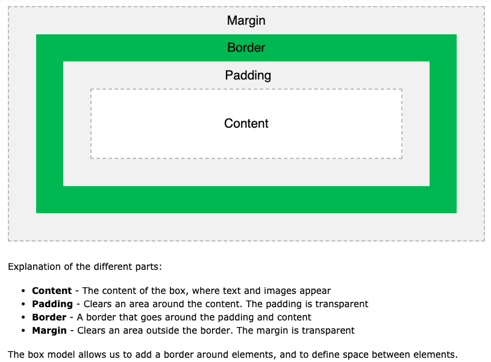
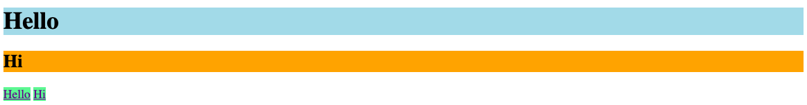

# Day 2

## Objective
- Intro to Atom text editor and file paths
- CSS Layout and Flexbox

## Resources
- Atom text editor: https://atom.io/
- Flexbox Froggy: https://flexboxfroggy.com/
- HTML, CSS, JS reference: https://www.w3schools.com/

## Table of Contents
1. **Background**
  * What is a text editor? Atom?
  * How do I create and link my HTML, CSS, and JS files?
2. **Browser developer tools**
  * [Inspector](#the-inspect-tool)
3. **CSS Layout**
  * [CSS box model](#css-box-model)
  * [Display: Inline vs Block](#display-inline-vs-block)
4. **CSS Flexbox**
  * [Display: Flex](#display-flex)
  * [Flexbox Froggy](#flexbox-froggy)
5. **Project**
  * [Designer Calendar](https://github.com/junior-devleague/designer-calendar)

## Background

### What is a text editor?
A text editor is a type of program used for editing plain text files. Text editors allows you to create and edit programming language files (HTML, CSS, JS..etc.) - this is where you write your code! Note that word processors (Microsoft Word, Google Docs...etc.) do not work for coding. This is because word processors have formatted text (e.g. font, indentation, bold...etc.) that is not used for coding. Coding must be done in plain text.

### What is the Atom text editor?
There are many text editors that you can choose from. In this class, we will use the [Atom editor](https://atom.io/). You can download it on your own computer at home. In the computers in class, we also added the Emmet plugin which allows you to use many handy shortcuts while coding.

### How do I create and link my HTML, CSS, and JS files in Atom?
1. Open Atom.
2. Create a folder on your computer.
3. In Atom, File -> Add Project Folder and select the folder you created.
4. In Atom, File -> Create File.
5. In Atom, File -> Save As and name your file index.html.
6. Create two more files and add it to your folder. Name them as follows:
- styles.css
- app.js

Notice the text after the ```.``` in your file name (e.g. .html, .css, .js). This extension is what tells the type of programming language in your file. The ```index.html``` file contains HTML. The ```style.css``` file contains CSS, and the ```app.js``` contains JavaScript.

7. In your HTML file, type in an exclamation point ```!``` and press tab. This is an Emmet shortcut that allows us to initialize our HTML file. It should look something like below.

``` html
<!DOCTYPE html>
<html lang="en">
<head>
  <meta charset="UTF-8">
  <meta name="viewport" content="width=device-width, initial-scale=1.0">
  <meta http-equiv="X-UA-Compatible" content="ie=edge">
  <title>Document</title>
</head>
<body>

</body>
</html>
```
- The ```<!DOCTYPE html>``` declaration defines the document to be HTML
- The ```<html>``` element is the root element of an HTML page
- The ```<head>``` element contains metadata about the document (metacognition is thinking about thinking, metadata is data about data)
- The ```<title>``` element specifies a title for the document
- The ```<body>``` element contains the visible page content
- Reference: https://www.w3schools.com/html/html_intro.asp

8. You must link your CSS and JS files to the index.html as follows. Link your CSS file by adding the link element right before the title. Link your JS file by adding the script element right before the body end tag. Specify the file name in the href and src attributes:

``` html
<!DOCTYPE html>
<html lang="en">
<head>
  <meta charset="UTF-8">
  <meta name="viewport" content="width=device-width, initial-scale=1.0">
  <meta http-equiv="X-UA-Compatible" content="ie=edge">
  <!-- Link CSS file. -->
  <link rel="stylesheet" href="styles.css">
  <title>Document</title>
</head>
<body>

  <!-- Link JS file. -->
  <script src='app.js'></script>
</body>
</html>
```
Note: If your CSS or JS files are in a different folder respective to your HTML file, the path to your CSS or JS file will be different. See https://www.w3schools.com/html/html_filepaths.asp for more information.

9. Create a few elements in the body element as follows. Style elements as you usually would in your CSS file. Remember to save!:

``` html
<!DOCTYPE html>
<html lang="en">
<head>
  <meta charset="UTF-8">
  <meta name="viewport" content="width=device-width, initial-scale=1.0">
  <meta http-equiv="X-UA-Compatible" content="ie=edge">
  <!-- Link CSS file. -->
  <link rel="stylesheet" href="styles.css">
  <title>Document</title>
</head>
<body>
  <h1>Hello World!</h1>
  <p>This is my new webpage.</p>
  <!-- Link JS file. -->
  <script src='app.js'></script>
</body>
</html>
```

10. Open up Google Chrome. Drag the tab of your index.html file into the search engine and press enter. You should now see the output of your HTML, CSS, and JS. Your website is not accessible to the world yet, you are just viewing how the browser would render your HTML, CSS, and JS file.

## Browser Developer Tools

### The Inspect Tool

Google Chrome has some handy tools for us to use to "inspect" our website (e.g. see how our website looks, check if our website is working correctly, troubleshoot...etc.).

1. Right click on your webpage and click on ```Inspect```.
2. The inspector window will pop up. Several tabs that you should see are ```Elements```, ```Console```, ```Sources```, ```Network```...etc.
- In the ```Elements``` tab, you will find all of the elements on the webpage. Click on the arrows/triangles to display the elements nested within that particular element.
- In the ```Console``` tab, you will find the output of your ```console.log(x)``` written in your JS file. You can think of ```console.log(x)``` as asking the computer to print ```x``` for you. This is useful when you are trying to test your JS code.
- In the ```Styles``` tab, you will find all of the CSS styles in the webpage

You can do this ```Inspect``` on every webpage! Try it out and see how other websites are structured and styled.

## CSS Layout

### CSS Box Model
HTML elements can be considered as boxes. You can see the layers of boxes for each element in your Inspector. By clicking on the box with an arrow in the top left corner of your Inspector, you can mouse over elements on the page and see how the elements appear like boxes.

This CSS box model is that a box wraps around HTML elements. This box consists of margins, borders, padding, and content. The following image from W3schools shows you this box model.



Reference: https://www.w3schools.com/css/css_boxmodel.asp

### Display Inline vs Block
A CSS property called ```display``` specifies if and how an element is displayed. The default display value for most elements is ```block``` or ```inline```.

Have you ever wondered why some elements appear underneath each other, and other elements are right next to each other?



**Block-level** elements always start on a new line and take up the full width available. Examples of block-level elements include:
- ```<div>```
- ```<h1>``` - ```<h6>```
- ```<p>```

**Inline** elements do not start on a new line and only takes up as much width as necessary. Examples of inline elements include:
- ```<a>```
- ``````

We can also use the ```display``` property to hide or show elements without deleting and recreating them.

Learn more here: https://www.w3schools.com/css/css_display_visibility.asp

## CSS Flexbox

### Display Flex
CSS Flexbox makes it much easier to design responsive layout structures. We activate this flexbox mode by adding  ```display: flex;```.

Once you have mastered CSS Flexbox, it will be much easier to control how you want to position your elements on a webpage.

Guide to Flexbox: https://css-tricks.com/snippets/css/a-guide-to-flexbox/

### Flexbox Froggy
Complete this CSS Flexbox game (up to level 12) to practice using flexbox! You can finish the whole thing, however, most of what we will use in this class will be covered in levels 1-12. Notice how you apply the ```display: flex``` and flexbox properties to the parent element of the elements you want to move.

Flexbox Froggy: https://flexboxfroggy.com/

## Projects
1. [Designer calendar](https://github.com/junior-devleague/designer-calendar)
